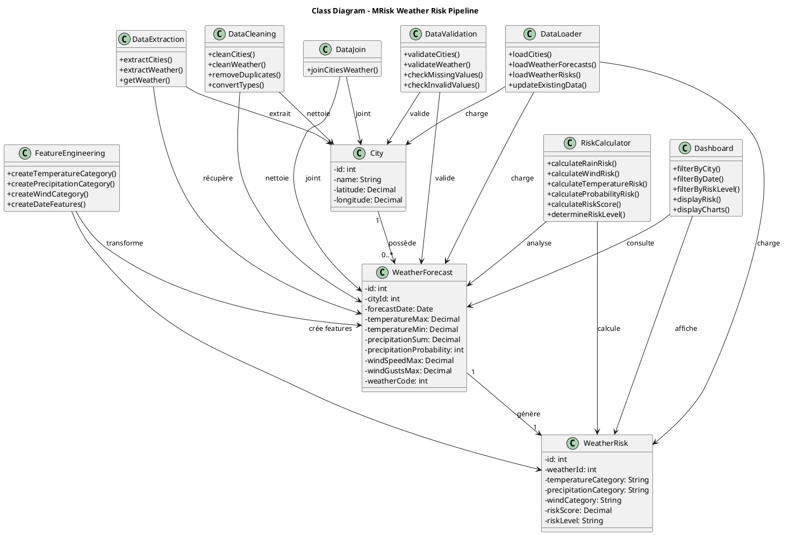

# Conception UML — MRisk

## 1. Présentation

**MRisk – Anticiper les perturbations logistiques au Maroc** est une plateforme de traitement et d'analyse des données météorologiques.

L'objectif est d'identifier les risques météorologiques pouvant perturber les opérations de livraison dans différentes villes marocaines.

Le système collecte les données météorologiques, les nettoie, les valide, calcule des indicateurs et produit un **Weather Risk Score** compris entre 0 et 100.

---

## 2. Architecture fonctionnelle

Le pipeline de données suit les étapes suivantes :

```text
SimpleMaps CSV
      │
      ▼
┌──────────────┐
│   Bronze     │
│ Données Raw  │
└──────────────┘
      │
      ▼
┌──────────────┐
│   Silver     │
│ Nettoyage    │
│ Validation   │
│ Jointure     │
└──────────────┘
      │
      ▼
┌──────────────┐
│     Gold     │
│ Features     │
│ Risk Score   │
└──────────────┘
      │
      ▼
┌──────────────┐
│ PostgreSQL   │
└──────────────┘
      │
      ▼
┌──────────────┐
│  Streamlit   │
│  Dashboard   │
└──────────────┘
```

L'orchestration du pipeline est réalisée avec **Apache Airflow**.

---

## 3. Modèle de données

Le modèle principal est composé de trois classes :

* `City`
* `WeatherForecast`
* `WeatherRisk`

### Relations

```text
City 1 ─────────── * WeatherForecast
WeatherForecast 1 ─────────── 1 WeatherRisk
```

Une ville peut avoir plusieurs prévisions météorologiques.

Chaque prévision météorologique possède un seul résultat d'évaluation du risque.

---

# 4. Diagramme de classes UML

Le diagramme suivant est réalisé avec **PlantUML**.



---

# 5. Description des classes

## 5.1 City

La classe `City` représente les villes marocaines utilisées dans le système.

### Attributs

| Attribut    | Type    | Description        |
| ----------- | ------- | ------------------ |
| `id`        | int     | Identifiant unique |
| `name`      | String  | Nom de la ville    |
| `latitude`  | Decimal | Latitude           |
| `longitude` | Decimal | Longitude          |

---

## 5.2 WeatherForecast

La classe `WeatherForecast` représente les prévisions météorologiques d'une ville pour une date donnée.

### Attributs

| Attribut                   | Type    | Description                  |
| -------------------------- | ------- | ---------------------------- |
| `id`                       | int     | Identifiant unique           |
| `cityId`                   | int     | Identifiant de la ville      |
| `forecastDate`             | Date    | Date de prévision            |
| `temperatureMax`           | Decimal | Température maximale         |
| `temperatureMin`           | Decimal | Température minimale         |
| `precipitationSum`         | Decimal | Quantité de précipitations   |
| `precipitationProbability` | int     | Probabilité de précipitation |
| `windSpeedMax`             | Decimal | Vitesse maximale du vent     |
| `windGustsMax`             | Decimal | Rafales maximales            |
| `weatherCode`              | int     | Code météorologique          |

---

## 5.3 WeatherRisk

La classe `WeatherRisk` représente l'évaluation du risque météorologique.

### Attributs

| Attribut                | Type    | Description                    |
| ----------------------- | ------- | ------------------------------ |
| `id`                    | int     | Identifiant unique             |
| `weatherId`             | int     | Prévision associée             |
| `temperatureCategory`   | String  | Catégorie de température       |
| `precipitationCategory` | String  | Catégorie de précipitation     |
| `windCategory`          | String  | Catégorie du vent              |
| `riskScore`             | Decimal | Score de risque entre 0 et 100 |
| `riskLevel`             | String  | Niveau du risque               |

Les niveaux de risque utilisés sont :

```text
0 – 24    → Faible
25 – 49   → Modéré
50 – 74   → Élevé
75 – 100  → Critique
```

---

# 6. Classes du pipeline ETL

## DataExtraction

Responsable de l'extraction des données depuis les sources externes.

Principales opérations :

```text
extractCities()
extractWeather()
getWeather()
```

Les données météorologiques sont récupérées depuis l'API Open-Meteo.

---

## DataCleaning

Responsable du nettoyage et de la standardisation des données.

Principales opérations :

```text
cleanCities()
cleanWeather()
removeDuplicates()
convertTypes()
```

Les opérations comprennent notamment :

* suppression des doublons ;
* conversion des types ;
* nettoyage des noms ;
* gestion des valeurs manquantes ;
* validation des coordonnées.

---

## DataValidation

Responsable du contrôle de la qualité des données.

Les contrôles comprennent :

* valeurs manquantes ;
* doublons ;
* coordonnées invalides ;
* précipitations négatives ;
* probabilités hors intervalle `[0,100]` ;
* vitesses de vent négatives.

---

## DataJoin

Responsable de la jointure entre les données des villes et les données météorologiques.

```text
City + WeatherForecast
          ↓
    WeatherJoined
```

---

## FeatureEngineering

Responsable de la création des variables utilisées pour l'analyse.

Exemples :

```text
Temperature Category
Precipitation Category
Wind Category
Forecast Day
Month
Day of Week
```

---

## RiskCalculator

Responsable du calcul du risque météorologique.

Le score final est calculé à partir de quatre composantes :

```text
Rain Risk          → 35 %
Wind Risk          → 30 %
Temperature Risk   → 20 %
Probability Risk   → 15 %
```

Formule :

```text
Risk Score =
    Rain Risk × 0.35
  + Wind Risk × 0.30
  + Temperature Risk × 0.20
  + Probability Risk × 0.15
```

Le résultat est compris entre `0` et `100`.

---

## DataLoader

Responsable du chargement des données Gold dans PostgreSQL.

Il charge notamment :

```text
cities
weather_forecasts
weather_risks
```

Le chargement utilise une stratégie **UPSERT** afin d'éviter la création de doublons lors des nouvelles exécutions du pipeline.

---

## Dashboard

Le dashboard Streamlit permet de consulter les résultats.

Fonctionnalités :

* filtrage par ville ;
* filtrage par niveau de risque ;
* filtrage par date ;
* sélection d'une période ;
* affichage du score de risque ;
* visualisation des précipitations ;
* visualisation des températures ;
* visualisation du vent ;
* affichage des prévisions.

---

# 7. Technologies utilisées

| Technologie    | Utilisation              |
| -------------- | ------------------------ |
| Python         | Traitement des données   |
| Pandas         | Manipulation des données |
| Open-Meteo API | Données météorologiques  |
| PostgreSQL     | Base de données          |
| Apache Airflow | Orchestration ETL        |
| Streamlit      | Dashboard                |
| Docker         | Conteneurisation         |
| PlantUML       | Modélisation UML         |

---

# 8. Organisation du projet

```text
weather-risk-pipeline/
│
├── dags/
│   └── weather_risk_dag.py
│
├── extraction/
│   ├── __init__.py
│   ├── cities.py
│   └── weather_api.py
│
├── transformation/
│   ├── __init__.py
│   ├── cleaning.py
│   ├── validation.py
│   ├── join_data.py
│   ├── features.py
│   └── risk_score.py
│
├── load/
│   ├── __init__.py
│   └── load_gold.py
│
├── dashboard/
│   └── app.py
│
├── data/
│   ├── bronze/
│   ├── silver/
│   └── gold/
│
├── db/
│   └── schema.sql
│
├── Dockerfile
├── Dockerfile.airflow
├── docker-compose.yml
└── README.md
```

---

# 9. Flux global du système

```text
                 ┌───────────────────┐
                 │   SimpleMaps CSV  │
                 └─────────┬─────────┘
                           │
                           ▼
                 ┌───────────────────┐
                 │  DataExtraction   │
                 └─────────┬─────────┘
                           │
                           ▼
                      ┌─────────┐
                      │ Bronze  │
                      └────┬────┘
                           │
                           ▼
                 ┌───────────────────┐
                 │   DataCleaning    │
                 └─────────┬─────────┘
                           │
                           ▼
                 ┌───────────────────┐
                 │  DataValidation   │
                 └─────────┬─────────┘
                           │
                           ▼
                 ┌───────────────────┐
                 │     DataJoin      │
                 └─────────┬─────────┘
                           │
                           ▼
                 ┌───────────────────┐
                 │FeatureEngineering │
                 └─────────┬─────────┘
                           │
                           ▼
                 ┌───────────────────┐
                 │  RiskCalculator   │
                 └─────────┬─────────┘
                           │
                           ▼
                      ┌─────────┐
                      │  Gold   │
                      └────┬────┘
                           │
                           ▼
                 ┌───────────────────┐
                 │    DataLoader     │
                 └─────────┬─────────┘
                           │
                           ▼
                    ┌─────────────┐
                    │ PostgreSQL  │
                    └──────┬──────┘
                           │
                           ▼
                    ┌─────────────┐
                    │  Streamlit  │
                    │  Dashboard  │
                    └─────────────┘

              Apache Airflow orchestre le pipeline

